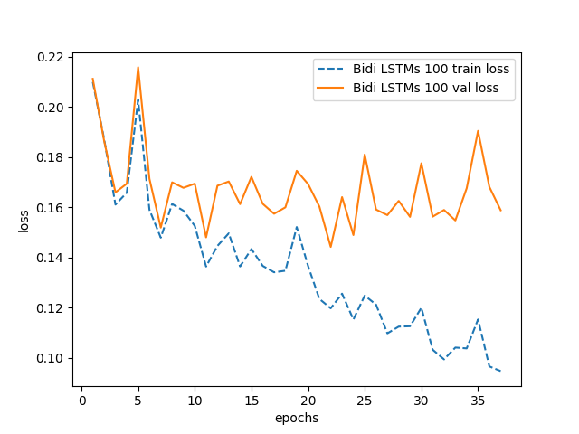
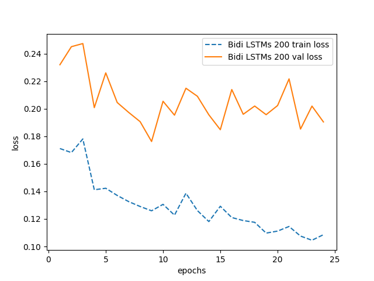
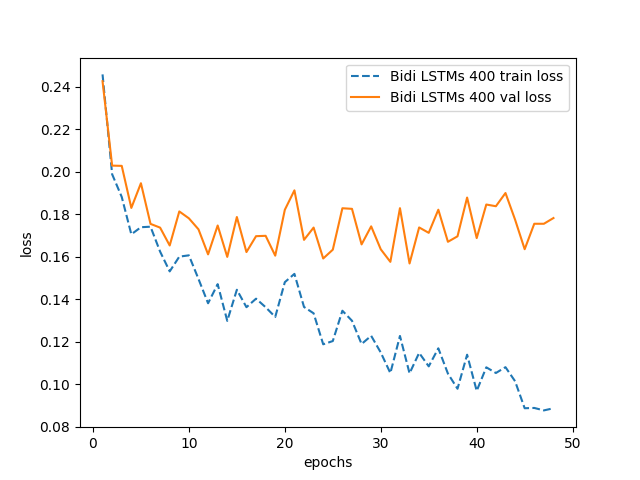
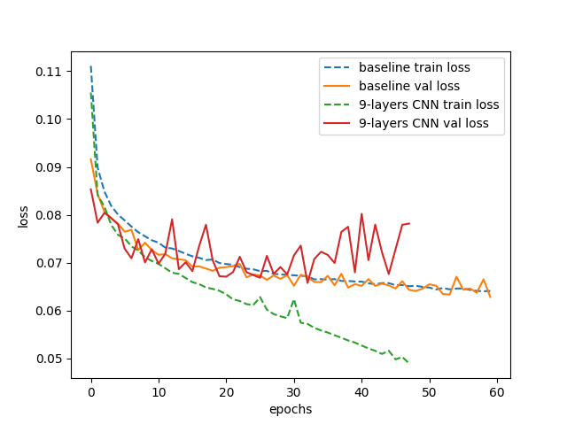
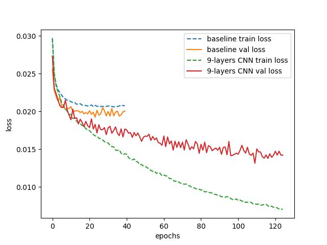

# Jingju Singing Syllable Segmentation
The code in this repo aims to help reproduce the results in the work:
>Jordi Pons, Rong Gong, and Xavier Serra. 2017. Score-informed Syllable Segmentation for A Cappella Singing Voice with Convolutional Neural Networks. In 18th International Society for Music Information Retrieval Conference. Suzhou, China.

This paper introduces a new score-informed method for the segmentation of jingju a cappella singing voice into syllables. The proposed method estimates the most likely sequence of syllable boundaries given the estimated syllable onset detection function (ODF) and its score. Throughout the paper, we first examine the jingju syllables structure and propose a definition of the term “syllable onset”. Then, we identify which are the challenges that jingju a cappella singing poses. We propose using a score-informed Viterbi algorithm –instead of thresholding the onset function–, because the available musical knowledge we have can be used to inform the Viterbi algorithm in order to overcome the identified challenges. In addition, we investigate how to improve the syllable ODF estimation with convolutional neural networks (CNNs). We propose a novel CNN architecture that allows to efficiently capture different time- frequency scales for estimating syllable onsets. The proposed method outperforms the state-of-the-art in syllable segmentation for jingju a cappella singing. We further provide an analysis of the segmentation errors which points possible research directions.

## Steps to reproduce the experiment results
1. Clone this repository
2. Download Jingju a capella singing dataset, scores and syllable boundary annotations from https://goo.gl/y0P7BL
3. Change `dataset_root_path` variable in `src/filePath.py` to locate the above dataset
4. Python 2.7.9 and Essentia 2.1-beta3 were used in the paper; Install python dependencies from `requirements.txt`.
5. Set `mth_ODF`, `layer2`, `fusion` and `filter_shape` variables in `src/parameters.py`
8. Run `python onsetFunctionCalc.py` to produce the experiment results for above parameter setting
9. Run `python eval_demo.py` to produce the evaluation result

## Steps to train CNN acoustic models
1. Do steps 1, 2, 3, 4 in **Steps to reproduce the experiment results**
2. Run `python trainingSampleCollection.py` to calculate mel-bands features
3. CNN models training code is located in `localDLScripts` folder. Use them according to the computing configurations (CPU, GPU).
4. Pre-trained models are located in `cnnModels` folders

## Dependencies
`numpy scipy matplotlib essentia scikit-learn cython keras theano hyperopt`

## License
Affero GNU General Public License version 3

## Supplementary information
Bock dataset Bidi LSTMs 100 losses (fold 2)

Bock dataset Bidi LSTMs 200 losses (fold 3)

Bock dataset Bidi LSTMs 400 losses (fold 0)

Bock dataset baseline and 9-layers CNN losses (model 2)

Jingju dataset baseline and 9-layers CNN losses (model 2)

